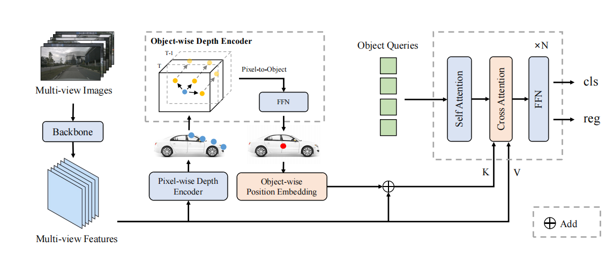

<div align="center">

# OPEN

### [OPEN: Object-wise Position Embedding for Multi-view 3D Object Detection](https://arxiv.org/abs/2407.10753)

[Jinghua Hou](https://github.com/AlmoonYsl) <sup>1</sup>,
[Tong Wang](https://scholar.google.com/citations?user=EpUu4zIAAAAJ) <sup>2</sup>,
[Xiaoqing Ye](https://shuluoshu.github.io/)  <sup>2</sup>,
[Zhe Liu](https://github.com/happinesslz) <sup>1</sup>,
Shi Gong <sup>2</sup>,
[Xiao Tan](https://scholar.google.com/citations?user=R1rVRUkAAAAJ) <sup>2</sup>,<br>
[Errui Ding](https://scholar.google.com/citations?user=1wzEtxcAAAAJ) <sup>2</sup>,
[Jingdong Wang](https://jingdongwang2017.github.io/) <sup>2</sup>,
[Xiang Bai](https://xbai.vlrlab.net/) <sup>1,✉</sup>
<br>
<sup>1</sup> Huazhong University of Science and Technology,
<sup>2</sup> Baidu Inc.
<br>
✉ Corresponding author.
<br>

**ECCV 2024**

[](https://arxiv.org/abs/2407.10753)

</div>

**Abstract** Accurate depth information is crucial for enhancing the performance of multi-view 3D object detection. Despite the success of some existing multi-view 3D detectors utilizing pixel-wise depth supervision, they overlook two significant phenomena: 1) the depth supervision obtained from LiDAR points is usually distributed on the surface of the object, 
which is not so friendly to existing DETR-based 3D detectors due to the lack of the depth of 3D object center; 2) for distant objects, fine-grained depth estimation of the whole object is more challenging. Therefore, we argue that the object-wise depth (or 3D center of the object) is essential for accurate detection. In this paper, we propose a new multi-view 3D object detector named OPEN, whose main idea is to effectively inject object-wise depth information into the network through our proposed object-wise position embedding. Specifically, we first employ an object-wise depth encoder, which takes the pixel-wise depth map as a prior, to accurately estimate the object-wise depth. Then, we utilize the proposed object-wise position embedding to encode the object-wise depth information into the transformer decoder, thereby producing 3D object-aware features for final detection. Extensive experiments verify the effectiveness of our proposed method. Furthermore, OPEN achieves a new state-of-the-art performance with 64.4% NDS and 56.7% mAP on the nuScenes test benchmark.



## News
* **2024.07.02**: Our another work [SEED](https://github.com/happinesslz/SEED) has also been accepted at ECCV 2024. 🎉
* **2024.07.02**: OPEN has been accepted at ECCV 2024. 🎉

## Results
* **nuScenes Val Set**

| Model | Backbone | Resolution | NDS  | mAP  | Config | Download |
|:-----:|:--------:|:----------:|:----:|:----:|:------:|:----:|
| OPEN  |   R50    | 256 x 704  | 56.4 | 46.5 |       |      |
| OPEN  |   R101   | 512 x 1408 | 60.6 | 51.6 |       |      |

* **nuScenes Test Set**

| Model | Backbone | Resolution | NDS  | mAP  | Config | Download |
|:-----:|:--------:|:----------:|:----:|:----:|:----:|:----:|
| OPEN  |  V2-99   | 640 x 1600 | 64.4 | 56.7 |       |      |

## TODO
- [x] Release the paper.
- [ ] Release the code of OPEN.

## Citation
```
@inproceedings{
  hou2024open,
  title={OPEN: Object-wise Position Embedding for Multi-view 3D Object Detection},
  author={Hou, Jinghua and Wang, Tong and Ye, Xiaoqing and Liu, Zhe and Tan, Xiao and Ding, Errui and Wang, Jingdong and Bai, Xiang},
  booktitle={ECCV},
  year={2024},
}
```

## Acknowledgements
We thank these great works and open-source repositories:
[PETR](https://github.com/megvii-research/PETR), [StreamPETR](https://github.com/exiawsh/StreamPETR), and [MMDetection3D](https://github.com/open-mmlab/mmdetection3d).
